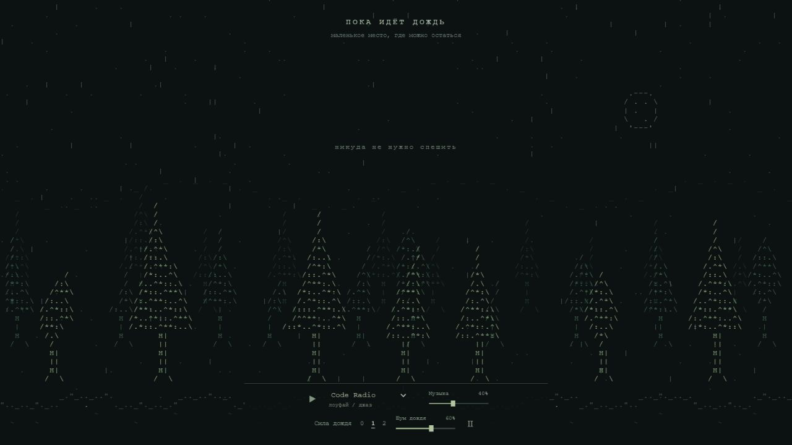
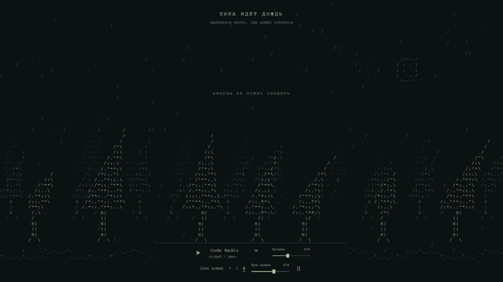

<div align="center">

# Пока идёт дождь

*маленькое место, где можно остаться*

[Открыть лес](https://nervan-iwnl.github.io/ascii-rain/)

`ASCII` · `лоуфай` · `один HTML`

</div>



Дождь из символов. Деревья, которые качаются на ветру. Тихая музыка и иногда — «никуда не нужно спешить».

Небольшой пет-проект о том, сколько атмосферы можно поместить в одну страницу.

## Внутри леса

- **Три состояния дождя:** 0 — тишина, 1 — тихий дождь, 2 — ливень. Капли и звук переключаются вместе.
- **Ветер:** при ливне деревья гнутся сильнее; курсор тоже меняет его направление.
- **Радио:** Code Radio, Groove Salad и I Love Chillhop. Музыка и дождь имеют отдельную громкость.
- **Общая пауза:** останавливает музыку, шум и анимацию.

<details>
<summary>Когда дождь становится сильнее</summary>



</details>

## Клавиши

| Клавиша | Действие |
| :--- | :--- |
| `Пробел` | Пауза / продолжить |
| `M` | Включить / выключить музыку |
| `0` · `1` · `2` | Сила дождя |
| `↑` · `↓` | Громкость музыки, шаг 5% |
| `Shift` + `↑` · `↓` | Громкость дождя, шаг 5% |

`M` работает и при русской раскладке. Когда фокус находится в ползунке или списке станций, клавиши управляют этим элементом.

## Маленький по размеру

**11 993 байта HTML · 5 230 байт с gzip.**

Canvas рисует символы, Web Audio создаёт шум дождя. Стили и JavaScript встроены в страницу: без внешних шрифтов, картинок и библиотек. Радио подключается только после нажатия. Снимки в этом README не загружаются самим сайтом.

Для интерфейса нужен один HTTP-запрос. Это не обещание одного TCP-handshake: соединением и его начальным окном управляет хостинг.

## Запустить и изменить

Для просмотра достаточно открыть **[`index.html`](index.html)** в браузере. Для радио нужен интернет.

Правки делаются в **[`index-readable.html`](index-readable.html)** — версии с понятными именами и отступами. Минификатор создаёт готовую страницу:

```text
index-readable.html  →  build.cjs  →  index.html
```

```sh
npm install       # один раз
npm run build     # после правок
```

Сборка выводит размер HTML и gzip. `esbuild-wasm` нужен только для сборки, посетители его не скачивают.

Чтобы обновить GitHub Pages:

```sh
git add index-readable.html index.html
git commit -m "Update forest"
git push
```

Pages публикует корень ветки `main`. Файл `.nojekyll` отключает обработку Jekyll.

---

<div align="center">
<sub>никуда не нужно спешить</sub>
</div>
